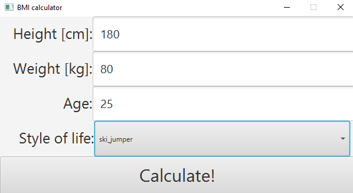

# Extended BMI calculator

## Introduction

Body mass index (BMI) - a index calculated by dividing the body weight in kilograms 
by the square of the height in meters. A classification for the BMI 
has been developed for adults only and must not be used in children. For correct 
assessment child development, percentile grids are used, which should be adjusted
for a given population. The determination of the body mass index is important in 
the assessment the risk of diseases related to overweight and obesity, e.g. diabetes, 
disease ischemic heart disease, atherosclerosis. Higher BMI values are assumed to 
be related with increased risk to health and life.

## Aim of the project

In the standard approach, the ranges define belonging to a category determining 
our weight are very strict. For example, the person whose  BMI is 18.48 
is underweight, while a person with a value of 18.51 is already underweight 
desired body weight.

*Adult body weight classification based on standard BMI*

This is a fairly inflexible approach, so the project's aim was to create
an app that can better determine a person's BMI. Moreover,
two additional parameters (apart from the standard weight and height) were added: age
and lifestyle. Nevertheless, the BMI value is still 21.75
the most desirable body mass index.

## Input data
After starting the application, a window appears for entering the data:

- The height in centimeters in the range from 140 to 240 cm. 
- The weight in kilograms in the range from 40 to 250 kg. 
- The age must be between 16 and 100 years old

The most interesting parameter is the lifestyle:

There are several options to choose from:
- ski jumper
- runner
- a person performing sedentary work
- a person performing manual work
- strong man
  
They are introduced to calculate more precisely the  BMI for the person. It is worth notice that the ski jumper whose weight is 55 kg at
height of 170 cm is usually not emaciated, as indicated by the standard
BMI index. However, a strong man with the same height but weighing 100 kg is not
is overweight, as this is the optimal weight for him.

## Usage
To run the program, enter the path to the folder *resources/logic* folder where there are
.fcl files with program logic. And then enter height, weight, age and choose the proper lifestyle.

## Sample results

*PS. This app should not be considered as perceived as a medical calculator for any person 
because it's just an example of how can the standard BMI improved. Inputed data in \*.fcl files 
is just an example data and should be consulted with doctor.*